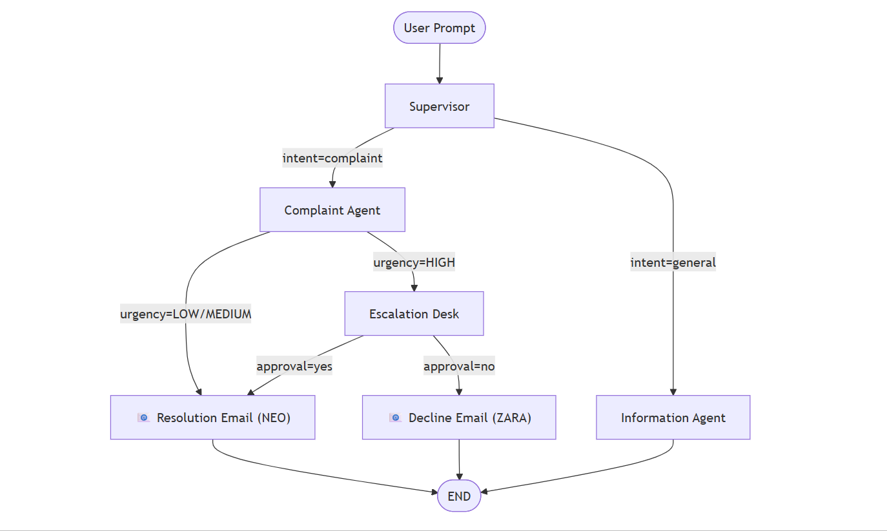
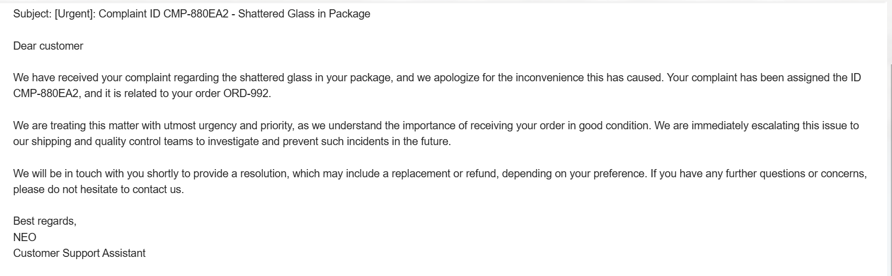

# Multi-Agent Complaint System with Human-in-the-Loop

 
 
 


Customer support teams often struggle with high volumes of trivial queries mixed with urgent complaints. This AI-driven multi-agent system automates the triage process—resolving general questions instantly while intelligently routing critical, high-severity issues to human managers for review. 

The core engine is built using **LangGraph** to coordinate multiple LLM agents (powered by Groq/Llama-3 and Google Gemini) which process customer inquiries, classify complaints, assess urgency, loop in human reviewers when needed, and automate final email responses.



---

## 🚀 Key Features

*   **Orchestrator-Worker Flow**: Driven by LangGraph, utilizing an orchestrator-worker architecture to handle complex customer support workflows efficiently.
*   **Intelligent Intent Routing (Supervisor Agent)**: Powered by **Llama-3 (Groq)**. Acts as the primary orchestrator, analyzing incoming messages and classifying them as either a `complaint` or a `general` inquiry.
*   **Issue Resolution (Complaint Agent)**: Powered by **Llama-3 (Groq)**. A worker agent that automatically extracts critical details (e.g., Order IDs), assesses damage, and determines the severity (HIGH, MEDIUM, LOW) of incoming grievances.
*   **General Support (Information Agent)**: Powered by **Gemini-2.5-Flash**. A worker agent that handles general knowledge and customer support queries, ensuring fast, helpful, and context-aware replies.
*   **Human-in-the-Loop (HITL)**: High-severity complaints are paused for mandatory manager approval before proceeding.
*   **Dynamic Email Notifications**: Generates professional, context-rich emails with custom subject lines signed by virtual assistants (**NEO** and **ZARA**).
    
    
*   **Persistent Session Memory**: Remembers the entire conversation history using `MemorySaver`, allowing for fluid, multi-turn interactions.
*   **Detailed Execution Logs**: Every decision, agent thought, and phase transition is recorded in `data/session_logs.json` for full traceability.

---

## 🏗️ Architecture & Agents

### Core Engine
*   **`supervisor`**: The entry point. Uses Llama-3 to determine if the user is complaining or just asking for info.
*   **`complaint`**: Extracts Order IDs, issues, and determines severity.
*   **`info`**: Uses Gemini-2.5-Flash to provide helpful, general support.
*   **`human`**: A specialized node for manual manager review of high-urgency cases.
*   **`email`**: The primary fulfillment tool that sends formal resolutions to customers.

### Project Structure
```text
├── main.py                     # CLI Entry Point & Session Manager
├── graph.py                    # LangGraph Definition (Nodes + Edges)
├── state.py                    # Shared AgentState Definition
├── assets/                     # Media & Documentation Images
├── agents/                     # Specialized AI Nodes
│   ├── supervisor.py           # Intent Router (Llama)
│   ├── complaint_agent.py      # Severity & Issue Extraction
│   ├── info_agent.py           # General Knowledge (Gemini)
│   ├── human_node.py           # HITL Approval Logic
│   └── notify_customer_node.py  # Escalation Decline Notifications
├── tools/                      # Business Logic Fulfillment
│   └── email_tool.py           # Dynamic Email Generator (NEO)
├── services/                   # External APIs & Integrations
│   ├── llm_service.py          # Groq & Gemini API Clients
│   └── email_service.py        # SMTP Gmail Integration
├── utils/                      # Internal Utilities
│   ├── logger.py               # Session & Complaint Logging
│   └── id_generator.py         # Unique Reference Generator
└── data/                       # Local Persistence Layer
    ├── complaints.json         # Resolved Complaint Database
    ├── session_logs.json       # Technical Session Traces
    └── LOGS_GUIDE.md           # Documentation for Log Analysis
```

---

## 🛠️ Setup & Installation

1.  **Clone the repository**:
    ```bash
    git clone https://github.com/tulika105/Multi-Agent-Complaint-System.git
    cd Multi-Agent-Complaint-System
    ```

2.  **Install dependencies**:
    ```bash
    pip install -r requirements.txt
    ```

3.  **Configure Environment Variables**:
    Create a `.env` file in the root directory and add your API keys:
    ```env
    GROQ_API_KEY=your_groq_key
    GEMINI_API_KEY=your_gemini_key
    EMAIL_USER=your_email@gmail.com
    EMAIL_PASS=your_app_password
    ```

---

## 🎮 Usage

Run the main application:
```bash
python main.py
```
> **Note:** Type `exit` and press Enter at any time to gracefully close the application.

### Example Workflow:
1.  **User**: *"I ordered an LG Fridge (Order #5666) but the glass is broken."*
2.  **Supervisor**: Pauses the system to ask for your **Email Address**.
3.  **Manager Approval**: Since it's a "broken product" (HIGH urgency), the system pauses for **Manager Approval**.
4.  **Result**: An automated email is sent to the customer with a custom subject: `Urgent: Complaint ID CMP-XXXX - Broken Glass in LG Fridge`.

---

## 📊 Monitoring & Logs

*   **`data/complaints.json`**: A record of all successfully processed and resolved complaints.
*   **`data/session_logs.json`**: The technical trace of the full session logic.
*   **`data/LOGS_GUIDE.md`**: A helpful guide on how to read and interpret the session logs.

---
